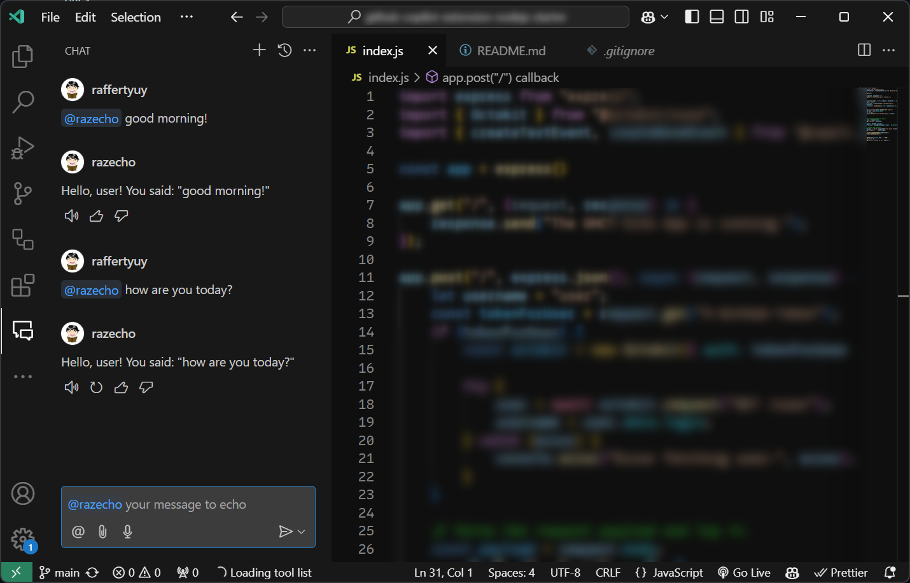
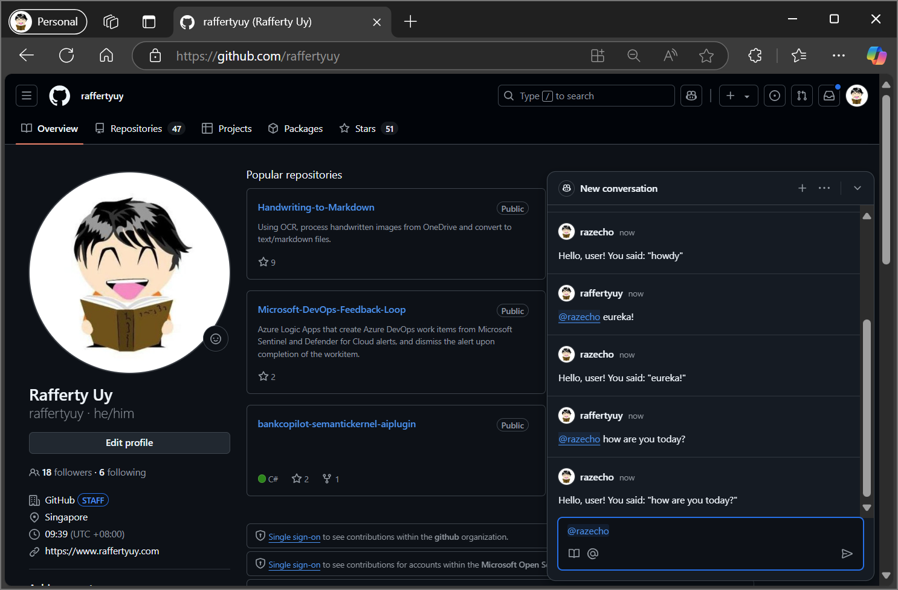
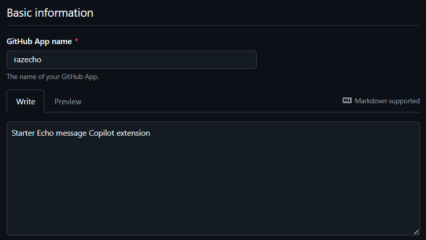
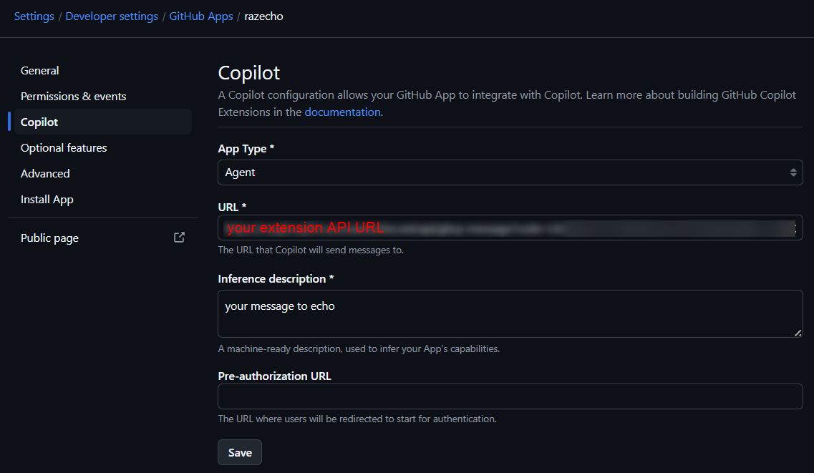

# github-copilot-extension-nodejs-starter

This is a simple GitHub Copilot Chat extension that simply echo's what you say.
This sample is developed using Node.js with no particular host in mind. If you plan to deploy to Azure Functions, check out [this repository](https://github.com/raffertyuy/github-copilot-extension-nodejs-azfunction-starter).




> [!TIP]
> This extension is inspired by the basic [tutorial video](https://youtu.be/ky5TMI9skLE) from @ambilykk. Do check it out!

## Running and Debugging Locally
**Pre-requisites:**
GitHub Debug CLI: see [gh debug-cli](https://docs.github.com/en/copilot/building-copilot-extensions/debugging-your-github-copilot-extension)

**Run the app locally:**
```bash
npm install
npm start
```

**In a new terminal, use the `gh debug-cli`:**
```bash
export URL="http://localhost:3000" #if using Windows Command Prompt, use `set` instead of `export`

gh debug-cli
```

## Running and Debugging in Codespaces
### Run in Codespaces
1. Open this repo in GitHub Codespaces
2. `npm install` and `npm start`
3. In the **Ports** tab, right-click the _Forwarded Address_ and change _Port Visibility_ to _Public_
4. Copy the _Forwarded Address_ URL

### Add a new GitHub App
1. Go to your _GitHub Profile → Settings → Developer settings → New GitHub App_
2. Fill in the some initial values:
  - the _GitHub App name_ is going to be the `@agentname` that you'll use in the GH Copilot Chat
  - for test purposes, you may disable/uncheck _"Request user authorization (OAuth) during installation"_
3. Click _Copilot_ from the navigation bar on the left
  - Change **App Type** to _Agent_
  - Change **URL** to the public _Forwarded Address_ URL of your GitHub Codespaces in step 4 above (this is also the URL you change when you deploy your extension publicly)
  - Change **Inference description** to the message you want your users to see on the chat box




### Test the Agent Extension
1. In GitHub.com, open the GitHub Copilot Chat window
2. Type your `@app-name Hi!` and hit **ENTER** (Note: The agent won't show up until you do this for the first time)
3. Start chatting in GitHub.com or in VSCode!